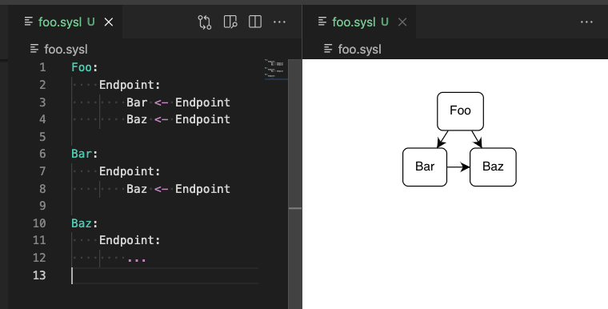

#  + 

# Sysl extension for Visual Studio Code

Accelerate your [Sysl](https://sysl.io/) spec development with rich language features and interactive side-by-side diagrams.

## Features

### Syntax

Sysl source syntax highlighting improves the legibility of Sysl specifications.

The Sysl language server provides additional language features, and is implemented in [anz-bank/sysl](https://github.com/anz-bank/sysl/blob/master/cmd/sysllsp/main.go).

### Diagrams

Visualize a specification as an interactive diagram in real time.

## Requirements

Just [Visual Studio Code](https://code.visualstudio.com/). The extension will fetch any other dependencies it needs (e.g. the Sysl binary).
