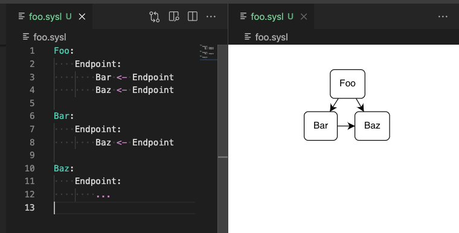

#  + 

# Sysl extension for Visual Studio Code

Accelerate your Sysl spec development with rich language features and interactive side-by-side diagrams.



## Features

### Syntax

Sysl source syntax highlighting improves the legibility of Sysl specifications.

The Sysl language server provides additional language features, and is implemented in [anz-bank/sysl](https://github.com/anz-bank/sysl/blob/master/cmd/sysllsp/main.go).

### Diagrams

Visualize a specification as an interactive diagram in real time.

## Requirements

Just [Visual Studio Code](https://code.visualstudio.com/). The extension will fetch any other dependencies it needs (e.g. the Sysl binary).

---

## Development

This project has multiple components arranged using Yarn workspaces and managed with [Lerna](https://lerna.js.org/).

```
.
├── package.json                # Manifest for the project workspace (managed by Lerna)
└── packages                    # Library for logic shared between other components
    ├── model                   # Library for logic shared between other components
    ├── plugin                  # Library for TypeScript LSP plugins to the extension
    ├── extension               # VS Code integration points
    │   ├── src                 # Extension source code
    │   │   ├── actions         # Definition and binding of plugin actions to VS Code
    │   │   ├── editor          # Custom editor binding for the renderer
    │   │   ├── lsp             # Code relating to the Language Server Protocol
    |   |   │   ├── client      # Implementation of the Sysl language client (calls `sysl lsp`)
    |   |   │   └── server      # Template for building simple LSP servers
    │   │   ├── plugins         # Logic for Sysl extension plugins, binding the client to servers
    |   |   │   ├── erd         # Built-in entity-relationship diagram plugin
    |   |   │   ├── examples    # Example plugin implementations
    |   |   │   └── integration # Built-in integration diagram plugin
    │   │   ├── protocol        # Schema and generated code for legacy plugin protocol (deprecated)
    │   │   ├── syntax          # Configuration for syntax highlighting
    │   │   ├── test            # Tests for the extension
    |   |   │   ├── fixtures    # Source files for testing
    |   |   │   └── ui          # End-to-end UI test cases
    │   │   ├── tools           # Logic for working with external programs (especially Sysl)
    │   │   ├── views           # Logic for working with renderer views
    │   │   ├── constants.ts    # Names used by the extension declared in package.json
    │   │   └── main.ts         # Extension entry point
    |   ├── .vscodeignore       # Config for which files to include in the extension package
    |   ├── icon.png            # Icon for the extension in the store
    |   └── package.json        # Manifest for the complete extension
    └── renderer                # React app to render custom views for the extension
        ├── build               # Build output (the extension loads runtime JS/CSS from here)
        ├── src                 # React app source code
        │   ├── components      # Components that comprise the app
        │   │   ├── diagram     # GoJS diagram rendering
        │   │   ├── html        # HTML page rendering
        │   │   ├── layout      # Containers of other components
        │   │   ├── views       # Types for the renderer to work with view abstractions
        │   │   └── vscode      # Abstraction of VS Code bindings
        │   ├── index.css       # Root styling
        │   ├── index.ts        # Document root
        │   └── App.tsx         # React app container
        ├── craco.config.js     # Additional config for the create-react-app build
        └── package.json        # Manifest for the React app
```

### Building

- `yarn install`: Installs all JS dependencies.
- `yarn build`: Transpiles TypeScript and creates a production build of all packages.
- `yarn package`: Creates production builds ready for publishing for all packages. For the extension, this is a [VSIX bundle](https://code.visualstudio.com/docs/editor/extension-marketplace#_install-from-a-vsix).

To work on the renderer in isolation, run `yarn install` and `yarn start` in the `renderer/` directory.

### Testing

To run the extension manually in an Extension Development Host, press `F5` to invoke the `Run Extension` launch configuration. In the new VS Code window, open a Sysl file (`*.sysl`) to exercise the extension's features

To run automated tests, including end-to-end UI tests, run `yarn test` or launch the `Test Extension` launch configuration.
